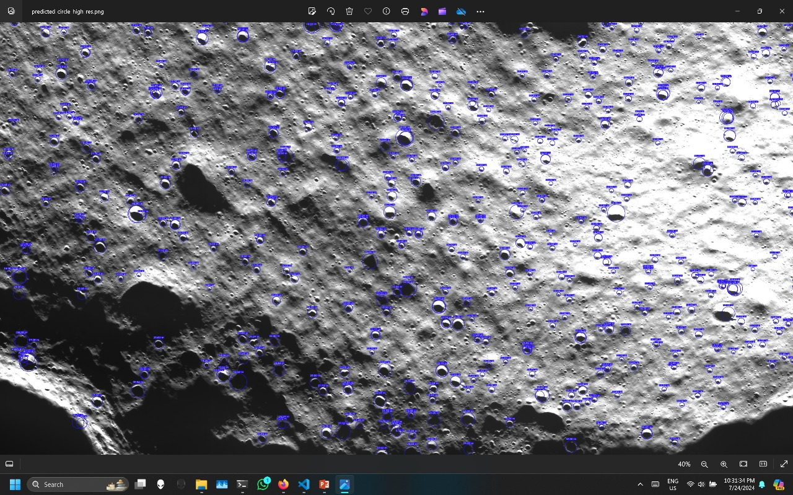
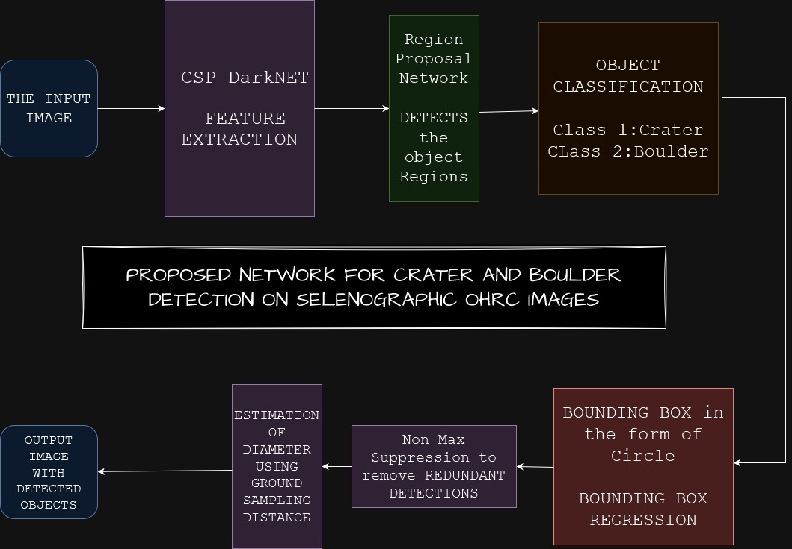

# Crater-Boulder-Detection
 This project was archived and is no longer actively maintained. Public access is provided for reference purposes only [from December 2025].

## Overview
This project implements an automated **crater and boulder detection pipeline** for high-resolution **lunar surface imagery**. It is designed to analyze large remote-sensing datasets and extract geological features relevant to **landing site evaluation, hazard analysis, and surface characterization**.

The system combines deep learning–based detection with geospatial processing to support scalable and repeatable lunar terrain analysis.

### Here's a picture of the lunar surface with detected craters and boulders:

---

## Problem Statement
Accurate identification of craters and boulders is essential for safe lunar missions. Manual annotation of high-resolution orbital imagery is slow, inconsistent, and not scalable to mission-scale datasets.

This project addresses the problem by automating detection using computer vision and machine learning, while supporting **very large input images** through tiling and spatial normalization.

---

## Features
- Automated detection of craters and boulders in lunar imagery  
- Tile-based processing for extremely large images  
- Diameter and dimension estimation using pixel-to-meter (DEM-based) scaling  
- Geospatial localization of detected features  
- Visualization and annotation of detections  
- Export of detection results in XML, text, and processed image formats  

---

## Utilities (Data Preparation & Tiling)

The `utils/` directory contains supporting tools for preparing large lunar datasets:

- Extraction utilities for handling archived lunar image downloads  
- Scripts to divide high-resolution **TIFF** and **PSD4** images into **1 m × 1 m tiles**  
- Automated tiling to enable efficient batch inference on very large surface maps  
- Preprocessing helpers for format conversion and directory structuring  

These utilities are intended for preparing raw orbital imagery before running the detection pipeline and are essential when working with full-resolution lunar datasets obtained from archival sources.

---

## Tech Stack
- Python – Core implementation  
- YOLO (Ultralytics) – Object detection model  
- OpenCV – Image processing and feature extraction  
- Streamlit – Interactive visualization and inference interface  
- NumPy and PIL – Image handling and transformations  
- CUDA – GPU-accelerated inference  

---

## Processing Pipeline
1. High-resolution lunar images are ingested from disk  
2. Images are preprocessed and divided into fixed-size tiles  
3. YOLO-based inference is performed on each tile  
4. Detected craters and boulders are annotated and indexed  
5. Physical dimensions are estimated using spatial scaling  
6. Results are exported as annotated images and structured data files  

---

## Model Weights
Running the detection pipeline requires the trained YOLO model weights (`.pt` file), which are not included in this repository due to size constraints.

The weights can be downloaded from the following link:  
https://drive.google.com/file/d/1LGhTr1WuqYC2eNBksiMvA9T_ptEQnFKf/view

---

## Sample Outputs
### Network Diagram Flow

### Web Interface for Inference

### Output Example

